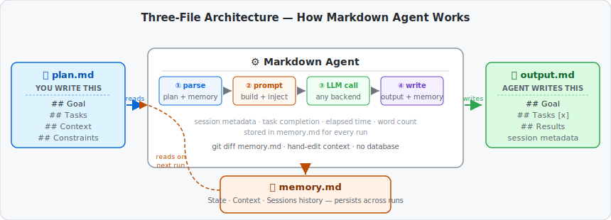
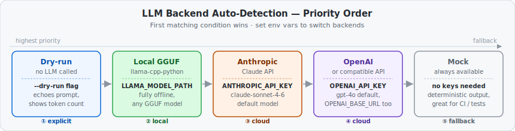

# Markdown-Agent — AI agent in three plain text files

> *Made autonomously using [NEO](https://heyneo.so) · [](https://marketplace.visualstudio.com/items?itemName=NeoResearchInc.heyneo)*

[](https://www.python.org/downloads/)
[](https://opensource.org/licenses/MIT)
[](tests/)

> Edit `plan.md` in any text editor, run one command, read the AI's response in `output.md` — no server, no database, no cloud account required.

## How it works



The entire agent lifecycle lives in three plain Markdown files:

| File | Who writes it | What it contains |
|---|---|---|
| `plan.md` | **You** | Goal, task checklist, context/constraints |
| `output.md` | **Agent** | Structured results, completed task list, session metadata |
| `memory.md` | **Agent** | State, context, and a log of every previous session |

`memory.md` is the key difference from a stateless prompt. The agent reads it at the start of every run and appends a new session block at the end, so it accumulates context across runs without any external database. Because it is plain text, you can `git diff`, hand-edit, or `cat` it at any time.

## Install

```bash
git clone https://github.com/dakshjain-1616/markdown-agent
cd markdown-agent
pip install -r requirements.txt
```

## Quickstart (no API key needed)

```bash
# 1. Write your goal in plan.md
cat > plan.md << 'EOF'
# Plan

## Goal
Summarise the key principles of clean code

## Tasks
- [ ] List the top 5 clean code principles
- [ ] Give a one-line example for each
EOF

# 2. Run the agent (uses Mock backend by default — no key needed)
python run_agent.py

# 3. Read the result
cat output.md
```

Or run the bundled quick-start example:

```bash
python examples/01_quick_start.py
```

## Backends



The agent auto-detects the best available backend. Set the relevant env var to switch:

| Backend | Trigger | Notes |
|---|---|---|
| **Dry-run** | `--dry-run` flag | Prints prompt + token count, calls no LLM |
| **Local GGUF** | `LLAMA_MODEL_PATH=/path/to/model.gguf` | Fully offline via llama-cpp-python |
| **Anthropic Claude** | `ANTHROPIC_API_KEY=sk-ant-...` | Default model: `claude-sonnet-4-6` |
| **OpenAI** | `OPENAI_API_KEY=sk-...` | Default model: `gpt-4o` |
| **Mock** | _(no key set)_ | Deterministic output, perfect for CI and tests |

### Switching backends

```bash
# Local model (offline)
LLAMA_MODEL_PATH=~/models/llama-3-8b.gguf python run_agent.py

# Anthropic Claude
ANTHROPIC_API_KEY=sk-ant-... python run_agent.py

# OpenAI (or any compatible endpoint)
OPENAI_API_KEY=sk-... OPENAI_MODEL=gpt-4o python run_agent.py

# OpenAI-compatible local server (Ollama, LM Studio, etc.)
OPENAI_API_KEY=ollama OPENAI_BASE_URL=http://localhost:11434/v1 python run_agent.py

# Force mock output regardless of env vars
python run_agent.py --backend mock
```

## plan.md format

The agent parses four optional sections. Only `## Goal` is required — the rest add context and improve output quality.

```markdown
# Plan

## Goal
One sentence describing what you want the agent to do.

## Tasks
- [ ] Specific step 1
- [ ] Specific step 2
- [x] Already-done step (agent skips these)

## Context
Background information, audience, relevant URLs, or prior findings
that the agent should know about this specific run.

## Constraints
Hard limits: word count, output format, scope restrictions, etc.
```

## memory.md format

The agent creates and manages this file automatically. You can edit it by hand at any time.

```markdown
# Memory

## Context
Free-text context that persists across every session.
Edit this to give the agent standing instructions.

## State
- last_run: 2026-03-27T14:22:00
- last_goal: Summarise clean code principles
- total_sessions: 3
- status: completed

## Sessions

### Session — 2026-03-27T14:22:00
- Timestamp: 2026-03-27T14:22:00
- Goal: Summarise clean code principles
- Tasks completed:
  - List the top 5 clean code principles
  - Give a one-line example for each
- Summary: Covered naming, functions, comments, formatting, and error handling...
```

## Environment variables

| Variable | Default | Description |
|---|---|---|
| `LLAMA_MODEL_PATH` | _(none)_ | Path to local GGUF file — activates llama backend |
| `ANTHROPIC_API_KEY` | _(none)_ | Activates Anthropic Claude backend |
| `ANTHROPIC_MODEL` | `claude-sonnet-4-6` | Override Claude model |
| `OPENAI_API_KEY` | _(none)_ | Activates OpenAI backend |
| `OPENAI_MODEL` | `gpt-4o` | Override OpenAI model |
| `OPENAI_BASE_URL` | _(none)_ | Point to any OpenAI-compatible server |
| `AGENT_MAX_TOKENS` | `2048` | Max tokens in LLM response |
| `AGENT_MAX_RETRIES` | `2` | Retry attempts on API failure |
| `AGENT_RETRY_DELAY` | `1.0` | Seconds between retries |
| `AGENT_FALLBACK_TO_MOCK` | `false` | Fall back to mock if all retries fail |
| `LLAMA_N_CTX` | `4096` | Context window for llama backend |
| `LLAMA_N_GPU_LAYERS` | `0` | GPU layers to offload (llama backend) |

## Built-in templates

Bootstrap a `plan.md` from a template without writing from scratch:

```python
from markdown_agent_3_fil import get_template, list_templates

print(list_templates())
# ['brainstorm', 'bug-report', 'code-review', 'data-analysis', 'research', 'weekly-review']

print(get_template("research"))
```

| Template | Use it for |
|---|---|
| `research` | Structured literature review or topic deep-dive |
| `code-review` | PR or codebase review with severity ratings |
| `brainstorm` | Idea generation with grouping and ranking |
| `bug-report` | Root cause analysis with fix options |
| `data-analysis` | Dataset exploration and statistics |
| `weekly-review` | Recurring team or personal review |

## Examples

| Script | What it demonstrates |
|---|---|
| `examples/01_quick_start.py` | Minimal two-task run with mock backend (no keys) |
| `examples/02_advanced_usage.py` | Custom backend, retry config, verbose prompt |
| `examples/03_custom_config.py` | Environment variable overrides |
| `examples/04_full_pipeline.py` | Multi-session workflow with memory inspection |

## Run tests

```bash
pytest tests/ -q
# 89 passed
```

## Why this over LangChain / AutoGPT / CrewAI

| | Markdown-Agent | Typical agent framework |
|---|---|---|
| State storage | Plain `.md` files | Vector DB / managed service |
| Inspect memory | `cat memory.md` | Proprietary dashboard |
| Edit memory | Any text editor | Code change + redeploy |
| Version control | `git diff memory.md` | Not possible |
| Local LLM | Drop in a GGUF path | Complex config |
| Zero dependencies | Yes (core: just Python) | 50+ transitive deps |
| CI friendly | Yes (mock backend) | Requires mocking framework |

## Project structure

```
markdown-agent/
├── markdown_agent_3_fil/
│   ├── executor.py       # core loop: parse → prompt → LLM → write
│   ├── parser.py         # plan.md and memory.md parsers
│   ├── backends.py       # Mock, DryRun, Anthropic, OpenAI, llama-cpp-python
│   ├── templates.py      # built-in plan.md templates
│   └── history.py        # session history formatting
├── examples/             # runnable demo scripts
├── tests/                # 89-test suite
├── run_agent.py          # CLI entry point
├── plan.md               # your goal goes here
├── memory.md             # auto-managed persistent state
└── output.md             # agent writes results here
```

## License

MIT
